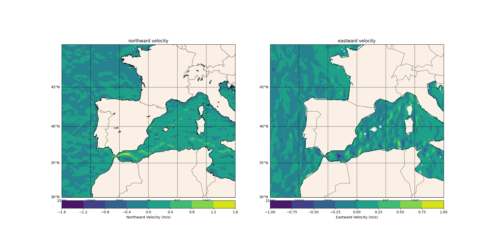
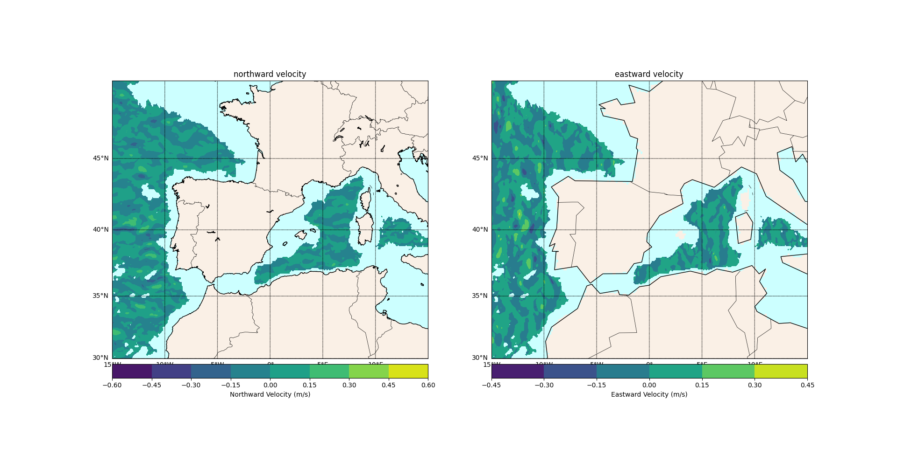

-*- mode: org -*-
#+STARTUP: fold
Title: Copernicus Marine
Format: markdown

* [Contents](#Contents){#Contents}
- [Copernicus Marine Toolbox](#Copernicus-Marine-Toolbox)
  - [Install](#install)
- [Netcdf](#netcdf)
- [h5tools](#h5tools)
  - h5dump
- [matplotlib](#matplotlib)
  - [basemap](#basemap)
- [References](#references)

** Copernicus Marine Toolbox

Access service either using a CLI or a Python wrapper to construct requests.

[New version 2.0](https://help.marine.copernicus.eu/en/articles/9978784-what-s-new-in-version-2-0-0-of-the-copernicus-marine-toolbox) out today (08/01/25) with breaking changes:


*** Install 
```
pip3 install copernicusmarine
pip3 show copernicusmarine
...
Requires: aiohttp, boto3, cachier, click, dask, lxml, nest-asyncio, netCDF4, numpy, pystac, requests, semver, setuptools, tqdm, xarray, zarr
...
```

*** Catalogue

The [describe.py]() file in this repo downloads the entire catalogue into a file called catalogue

The catalogue.go file decodes the downloaded json catalogue into a Go data structure for further processing and selection of dataset ids and object store URLs to be used in subsequent queries for data

*** Get / Subset

Most relevant options for download `dataset_id`, `filter`, `username`, `password`,

Don't use `force_download` as it has been deprecated in 2.0 and data sizes are very large!!

** Netcdf / HDF5


*** h5tools / h5dump

```
apt install h5tools
h5dump -H|-A <filename.nc> // dumps headers only with/out attributes, no data
h5dump -d <dataset_name> <filename.nc> // dumps data in dataset with dataset_name - usefuly only for small datasets
```

** matplotlib

```

*** basemap






** References 
